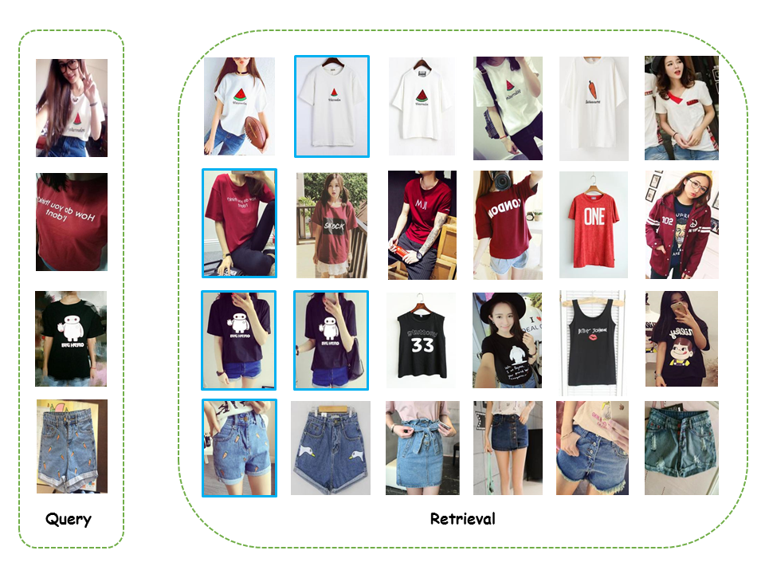

Multi-Negative Deep Metric for Image Retrieval
=============================

This repository has the source code for the paper "Multi-Negative Deep Metric for Image Retrieval". For the loss layer implementation, look at [here](https://github.com/icodingc/mndm-IR/blob/master/tf-slim-v2/ops/triplet_ops.py#L40). Networks can be found [here](https://github.com/icodingc/mndm-IR/blob/master/tf-slim-v2/nets/vgg.py#L135).

Example retrieval results on [DeepFashion](http://mmlab.ie.cuhk.edu.hk/projects/DeepFashion.html) dataset.  

## Prerequisites
1. Tensorflow r0.9
2. Download DeepFashion & CARS196 datasets.
3. Download pretrained VGG16 model from [here](http://download.tensorflow.org/models/vgg_16_2016_08_28.tar.gz).

## Training Procedure
- Ap cluster & generate negative sampling.
- run training scrips

## Feature extraction for Test
- extract feature
- run test scrips

#### *More details in the future. :)*
